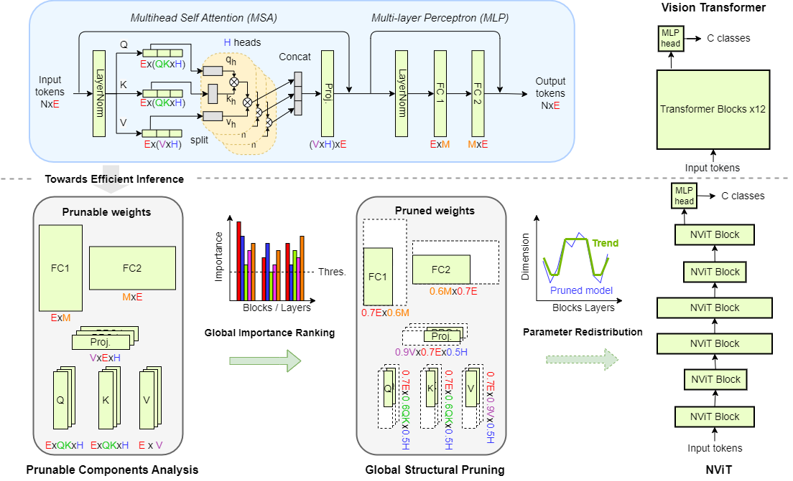

# Global Vision Transformer Pruning with Hessian-Aware Saliency

This repository is the official PyTorch implementation of [Global Vision Transformer Pruning with Hessian-Aware Saliency](https://arxiv.org/abs/2110.04869) (Also known as NViT) presented at CVPR 2023.

[Huanrui Yang](https://sites.google.com/view/huanrui-yang), 
[Hongxu (Danny) Yin](https://hongxu-yin.github.io/), 
[Maying Shen](https://mayings.github.io/),
[Pavlo Molchanov](https://www.pmolchanov.com/),
[Hai Li](https://ece.duke.edu/faculty/hai-helen-li), 
[Jan Kautz](https://jankautz.com/).

For business inquiries, please visit our website and submit the form: [NVIDIA Research Licensing](https://www.nvidia.com/en-us/research/inquiries/)

---

Useful links: <br>
* [Camera Ready PDF](https://openaccess.thecvf.com/content/CVPR2023/papers/Yang_Global_Vision_Transformer_Pruning_With_Hessian-Aware_Saliency_CVPR_2023_paper.pdf)<br>
* [ArXiv Full](https://arxiv.org/pdf/2110.04869.pdf)<br>
* [Video](https://www.youtube.com/watch?v=0D8O7yBw4h4)<br>

---

We propose NViT, a novel hardware-friendly global structural pruning algorithm enabled by a latency-aware, Hessian-based importance-based criteria and tailored towards the ViT architecture. NViT achieves a nearly lossless 1.9x speedup, significantly outperforms SOTA ViT compression methods and efficient ViT designs.




## Requirements

The code was tested in virtual environment with Python 3.8. The code works best with PyTorch 1.7.0+ and torchvision 0.8.1+ 

Besides PyTorch, [pytorch-image-models 0.3.2](https://github.com/rwightman/pytorch-image-models) and [einops](https://github.com/arogozhnikov/einops) are required. [TensorboardX](https://github.com/lanpa/tensorboardX) is used for logging. 

```
pip install timm==0.3.2
pip install einops
pip install tensorboardX
```

## Quick start

### Pretrained model pruning and finetuning

Please see [TRAINING.md](TRAINING.md) for detailed pruning and finetuning instructions of all models. 

### Pruned model evaluation

NViT model checkpoints after pruning and finetuning can be loaded and evaluated on ImageNet-1K using the following command:

```
python -m torch.distributed.launch --nproc_per_node=8 --use_env eval_nvit.py --finetune path/to/ft_checkpoint.pth --data-path /path/to/ImageNet2012/ --batch-size 256
```

The dimensions of each block will be automatically set based on the information stored in the checkpoint to accommodate different pruning configurations.  

### ViT parameter redistribution

Please see NViT [parameter redistribution repository](./revit/README.md) to evaluate our insight on ViT parameter redistribution, and to flexibly explore novel ViT designs with different dimensions in each block.


## Results + Pretrained Models

**NViT ImageNet-1K Pruned Models** Models pruned from the pretrained DeiT-B model. Speedup computed with respect to that of DeiT-B model, on a single V100 GPU with batch size 256.

<table>
  <tr>
    <th>Name</th>
    <th>Acc@1(%)</th>
    <th>Speedup(x)</th>
    <th>Resolution</th>
    <th>#Params(M)</th>
    <th>FLOPs(G)</th>
    <th>Download</th>
  </tr>

<tr>
    <td>NViT-B</td>
    <td>83.29</td>
    <td>1.86</td>
    <td>224x224</td>
    <td>34</td>
    <td>6.8</td>
    <td><a href="https://www.dropbox.com/scl/fi/jewbgp7yj8itftkpciocb/NViT_B.pth?rlkey=2s6fzd6dqqt70tvog89opd586&dl=0">model</a></td>
</tr>

<tr>
    <td>NViT-H</td>
    <td>82.95</td>
    <td>2.01</td>
    <td>224x224</td>
    <td>30</td>
    <td>6.2</td>
    <td><a href="https://www.dropbox.com/scl/fi/hkmmr1sjinygw65s0yku6/NViT_H.pth?rlkey=f72xry5i73of1h376ugy8tobv&dl=0">model</a></td>
</tr>

<tr>
    <td>NViT-S</td>
    <td>82.19</td>
    <td>2.52</td>
    <td>224x224</td>
    <td>21</td>
    <td>4.2</td>
    <td><a href="https://www.dropbox.com/scl/fi/fpavg8fb96gpqhaxvn05o/NViT_S.pth?rlkey=uwt7340bw3kqoyb570nfw9bm7&dl=0">model</a></td>
</tr>

<tr>
    <td>NViT-T</td>
    <td>76.21</td>
    <td>4.97</td>
    <td>224x224</td>
    <td>6.9</td>
    <td>1.3</td>
    <td><a href="https://www.dropbox.com/scl/fi/lokqjaj6kaneweer14v5m/NViT_T.pth?rlkey=764a8k9mp9xpz0wjyhhzgvtkc&dl=0">model</a></td>
</tr>


</table>


## Citation

Please consider citing NViT if this repository is useful for your work. 

```bibtex
@InProceedings{Yang_2023_CVPR,
    author    = {Yang, Huanrui and Yin, Hongxu and Shen, Maying and Molchanov, Pavlo and Li, Hai and Kautz, Jan},
    title     = {Global Vision Transformer Pruning With Hessian-Aware Saliency},
    booktitle = {Proceedings of the IEEE/CVF Conference on Computer Vision and Pattern Recognition (CVPR)},
    month     = {June},
    year      = {2023},
    pages     = {18547-18557}
}
```

## Licenses

Copyright © 2023, NVIDIA Corporation. All rights reserved.

This work is made available under the NVIDIA Source Code License-NC. Click [here](LICENSE) to view a copy of this license.

The pre-trained models are shared under [CC-BY-NC-SA-4.0](https://creativecommons.org/licenses/by-nc-sa/4.0/). If you remix, transform, or build upon the material, you must distribute your contributions under the same license as the original.

For license information regarding the timm repository, please refer to its [repository](https://github.com/rwightman/pytorch-image-models).

For license information regarding the DeiT repository, please refer to its [repository](https://github.com/facebookresearch/deit).

For license information regarding the ImageNet dataset, please see the [ImageNet official website](https://www.image-net.org/). 

## Acknowledgement

This repository is built on top of the [timm](https://github.com/huggingface/pytorch-image-models) repository. We thank [Ross Wrightman](https://rwightman.com/) for creating and maintaining this high-quality library.  

Part of this code is modified from the official repo of [DeiT](https://github.com/facebookresearch/deit.git). We thank the authors for their amazing work and releasing their code base. 
